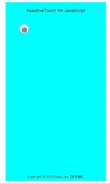

# assistive-touch-js

## Introduction

A pure JS implementation of an auxiliary floating button, similar to the AssistiveTouch in IPhone.

## Features

- Supports PC and mobile devices
- Supports up to nine first-level menus
- Supports multi-level display of menus
- Supports custom button styles
- Supports custom display layer styles
- Supports custom menu content
- Supports custom menu click events
- Has a movable boundary handling mechanism

## Software Architecture

Pure JS implementation, no dependencies.

## Screenshot



## Installation Guide

`npm i assistive-touch-js` or `yarn add assistive-touch-js`

## Usage Instructions

1. ES module import:
   `import AssistiveTouch from "assistive-touch-js";`
2. CommonJS module import:
   `const AssistiveTouch = require("assistive-touch-js/cjs.js");`
3. Script tag import:
   `<script src="./assistive-touch-js/bundle.js"></script>`

## Instantiation

```js
// Menu list
const menus = [
  {
    title: 'Return',
    icon: './assets/return.png', //or require("@/assets/return.png")
    callback: function () {
      console.log('Return');
    },
  },
  {
    title: 'Data Processing',
    icon: './assets/modify.png',
    children: [
      // Multi-level menu supported with keyword 'children'
      {
        title: 'Modify',
        icon: './assets/modify.png',
        callback: function () {
          console.log('Modify');
        },
      },
      {
        title: 'Delete',
        icon: './assets/delete.png',
        callback: function () {
          console.log('Delete');
        },
      },
    ],
  },
];

new AssistiveTouch({
  top: '80px', // Initial button positioning
  left: '50px', // Initial button positioning
  // Button style
  btnStyle: {
    width: '35px',
    height: '35px',
  },
  // Layer style
  layerStyle: {},
  menus,
});
```

## Demo

Clone this repository and directly run `./index.html`.

online: [AssistiveTouch Demo](https://max_law.gitee.io/assistive-touch-js)
