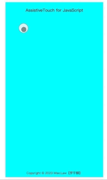

# assistive-touch-js

## 介绍

纯 JS 实现的辅助浮动按钮，类似于 IPhone 中的 AssistiveTouch。

## 功能特性

- 支持 PC 端与移动端
- 支持最多九个一级菜单
- 支持菜单多级显示
- 支持自定义按钮样式
- 支持自定义展示层样式
- 支持自定义菜单内容
- 支持自定义菜单点击事件
- 带有可移动边界处理

## 软件架构

纯 js 实现，无依赖。

## 效果图



## 安装教程

`npm i assistive-touch-js` 或 `yarn add assistive-touch-js`

## 使用说明

1. ES 模块引入
   `import AssistiveTouch from "assistive-touch-js";`
2. CommonJS module 引入
   `const AssistiveTouch = require("assistive-touch-js/cjs.js");`
3. script 标签引入
   `<script src="./assistive-touch-js/bundle.js"></script>`

## 实例化

```js
// 菜单列表
const menus = [
  {
    title: '返回',
    icon: './assets/return.png', //或 require("@/assets/return.png")
    callback: function () {
      console.log('返回');
    },
  },
  {
    title: '数据处理',
    icon: './assets/modify.png',
    children: [
      // 可多级菜单，关键字children
      {
        title: '修改',
        icon: './assets/modify.png',
        callback: function () {
          console.log('修改');
        },
      },
      {
        title: '删除',
        icon: './assets/delete.png',
        callback: function () {
          console.log('删除');
        },
      },
    ],
  },
];

new AssistiveTouch({
  top: '80px', // 初始按钮定位
  left: '50px', // 初始按钮定位
  // 按钮样式
  btnStyle: {
    width: '35px',
    height: '35px',
  },
  // 展开层样式
  layerStyle: {},
  menus,
});
```

## Demo

clone 本仓库并启动 web 服务，运行 `./index.html` 即可。

或者在线体验：[AssistiveTouch Demo](https://max_law.gitee.io/assistive-touch-js)
